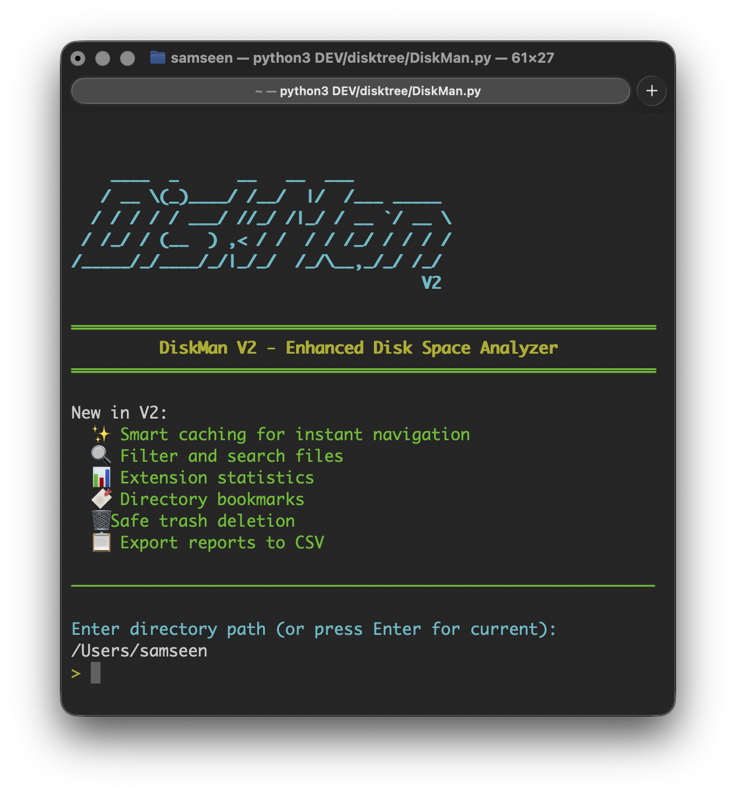
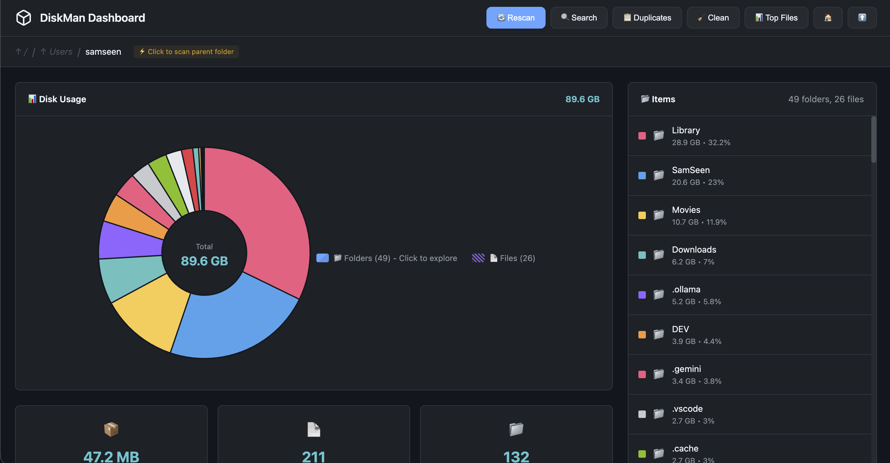

# DiskMan V3 - Advanced Disk Space Analyzer


**DiskMan V3** is a powerful, feature-rich disk space analyzer that helps you visualize, analyze, and manage storage usage with an intuitive terminal interface and interactive web dashboard.

## 🆕 What's New in V3

> **Web Dashboard** - The biggest update yet! Launch a beautiful interactive web UI with the `web` command:
> - 📊 Interactive pie chart with drill-down navigation
> - 🖼️ Image thumbnails and video previews
> - 🔍 Search, duplicates, and cache cleaner
> - 📁 Navigate parent folders with auto-rescan
> - 😄 Fun loading messages (just like the CLI!)

## 📸 Screenshots

<p align="center">
  
</p>
<p align="center"><em>Welcome Screen - Start scanning with a simple command</em></p>

<p align="center">
  
</p>
<p align="center"><em>CLI Interface - Navigate, search, and manage your files</em></p>

<p align="center">
  
</p>
<p align="center"><em>Web Dashboard - Interactive pie charts, file previews, and more!</em></p>

## ✨ Features

- **Smart Caching** - One deep scan, instant navigation
- **🌐 Web Dashboard** - Interactive browser UI with pie charts, image previews, and video playback
- **Deep Search** - Find files across all subfolders
- **Largest Files** - Instantly see biggest space hogs
- **System Cache Cleaner** - Clear common cache folders
- **Duplicate Finder** - Identify duplicate files
- **Bookmarks** - Save favorite directories
- **Safe Deletion** - Move to Trash instead of permanent delete
- **Export Reports** - CSV export for analysis

## 🚀 Quick Install (System-wide)

### One-Liner Install (macOS/Linux)

```bash
git clone https://github.com/mrsamseen/DiskMan.git ~/.diskman && pip3 install colorama humanize send2trash && chmod +x ~/.diskman/DiskMan.py && sudo ln -sf ~/.diskman/DiskMan.py /usr/local/bin/diskman && echo "✓ Installed! Run: diskman"
```

### Update Existing Installation

```bash
cd ~/.diskman && git pull && echo "✓ Updated to latest version!"
```

Now just type `diskman` from anywhere!

### Manual Install

```bash
# 1. Clone
git clone https://github.com/mrsamseen/DiskMan.git
cd DiskMan

# 2. Install dependencies
pip3 install colorama humanize send2trash

# 3. Run directly
python3 DiskMan.py
./DiskMan

# 4. (Optional) Make available system-wide
chmod +x DiskMan.py
sudo ln -sf "$(pwd)/DiskMan.py" /usr/local/bin/diskman
# Now run 'diskman' from anywhere!
```

### Windows

```powershell
git clone https://github.com/mrsamseen/DiskMan.git
cd DiskMan
pip install colorama humanize send2trash
python DiskMan.py
```

## 🎮 Commands

### Navigation
| Command | Action |
|---------|--------|
| `#` | Enter folder by number |
| `.` | Jump to scan root |
| `..` / `..3` | Go up 1 / 3 levels |
| `~` | Home directory |
| `g /path` | Go to specific path |
| `p` / `n` | Previous / Next page |

### File Actions
| Command | Action |
|---------|--------|
| `o #` | Open in Finder/Explorer |
| `d #` | Delete to Trash |
| `D #` | Permanent delete |
| `m # /path` | Move to path |
| `c # /path` | Copy to path |

### View Options
| Command | Action |
|---------|--------|
| `f text` | Filter current folder |
| `F text` | Deep search all subfolders |
| `h` | Toggle hidden files |
| `s` | Cycle sort: Size → Name → Date |
| `l 25` | Set items per page (5-50) |
| `r` | Rescan directory |

### Tools
| Command | Action |
|---------|--------|
| `web` | Launch interactive web dashboard |
| `b` | Manage bookmarks |
| `b+` | Bookmark current folder |
| `e` | Extension statistics |
| `top` | Show largest files |
| `dup` | Find duplicates |
| `clean` | System cache cleaner |
| `x` | Export to CSV |
| `?` | Full help page |

### Multi-Select
Select multiple items with:
- `d 1,3,5` - Items 1, 3, and 5
- `d 1-5` - Items 1 through 5
- `m 1-3,7 /tmp` - Move items 1, 2, 3, 7

## 🖥️ Display Icons

| Icon | Meaning |
|------|---------|
| `●` | Cached (fast) |
| `○` | Fresh scan |
| `👁` | Hidden files ON |
| `◌` | Hidden files OFF |
| `[S]` | Sort by Size |
| `[N]` | Sort by Name |
| `[D]` | Sort by Date |
| `◉ new` | < 3 months old |
| `◉ mid` | 3-12 months old |
| `◉ old` | > 1 year old |

## 📁 Project Structure

```
DiskMan/
├── DiskMan.py      # Main V2 entry point
├── DiskMan.py        # Legacy V1 (still works)
├── lib/           # V2 modules
│   ├── cache.py      # Smart caching system
│   ├── file_operations.py
│   ├── ui.py         # User interface
│   ├── utils.py      # Utilities
│   ├── bookmarks.py  # Bookmarks system
│   └── system_cache.py # Cache cleaner
└── lib/              # Legacy V1 modules
```

## ⚠️ Platform Compatibility

> **Tested on:** Apple M1 MacBook (macOS)
> 
> Linux and Windows *should* work fine, but haven't been fully tested. If you encounter any issues on your platform, please [open an issue](https://github.com/mrsamseen/DiskMan/issues) and I'll look into it!

## ☕ Support

If DiskMan helped you, consider supporting:

**[Buy Me a Coffee](https://buymeacoffee.com/samseen)**

## 📝 License

MIT License - see LICENSE file for details.

---

Created with ❤️ by [SamSeen](https://github.com/MrSamSeen/)
